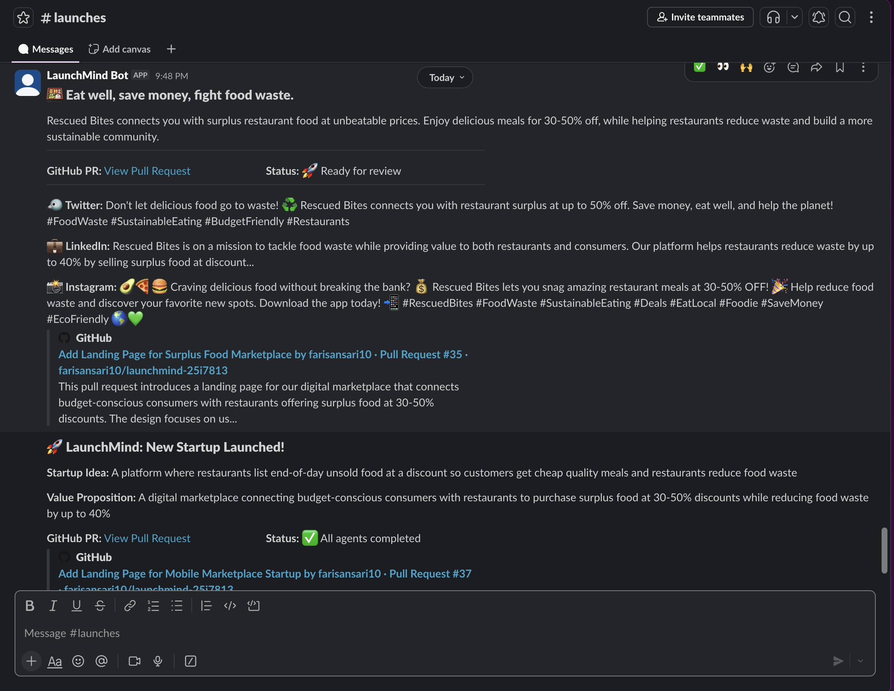

# 🍱 LaunchMind — SnackAlert

A Multi-Agent System (MAS) where autonomous AI agents collaborate to launch **SnackAlert** — a platform where restaurants list end-of-day unsold food at a discount so customers get cheap quality meals and restaurants reduce food waste.

Built for FAST NUCES Agentic AI / Multi-Agent Systems Assignment.

---

## 💡 Startup Idea

**SnackAlert** connects budget-conscious customers with restaurants offering end-of-day meals at 50-70% discount. Restaurants reduce food waste and recover lost revenue. Customers get quality meals at a fraction of the price. Available daily from 8PM–11PM.

**Target Users:** Restaurant owners + budget-conscious customers  
**Core Feature:** Restaurants post leftover food with price and pickup time; customers browse and claim it  
**Revenue Model:** 10% commission per sale from restaurants

---

## 🤖 Agent Architecture

The system has 5 agents that communicate through a shared message bus. Here is exactly which agent talks to which:

**CEO Agent** is the orchestrator and brain of the system. It starts the pipeline by receiving the startup idea and using Claude Sonnet to decompose it into 3 specific tasks. It sends a task message to the Product agent, Engineer agent, and Marketing agent simultaneously. After the Product agent responds, the CEO reviews the spec using an LLM and either approves it or sends a revision_request back — the Product agent then re-runs with the feedback. After QA reviews the Engineer's HTML, the CEO receives the verdict, reasons about it using an LLM, and if it fails, sends a revision_request to the Engineer agent — the Engineer then re-runs and generates improved HTML. Once all agents complete, the CEO posts a final summary to Slack.

**Product Agent** receives a task from the CEO. It uses Claude Haiku to generate a complete product specification including value proposition, personas, features, and user stories. It sends the spec to both the Engineer agent and the Marketing agent. It also sends a confirmation back to the CEO. If the CEO sends a revision_request, the Product agent reads the feedback and generates an improved spec.

**Engineer Agent** receives the product spec from the Product agent. It uses GPT-4o-mini to generate a complete HTML landing page, then takes real actions on GitHub: creates a new branch, commits the HTML file authored by EngineerAgent, creates a GitHub issue titled "Initial landing page", and opens a pull request with LLM-generated title and body. It sends the PR URL and issue URL back to the CEO. If the CEO sends a revision_request based on QA feedback, the Engineer re-runs and generates an improved HTML landing page addressing the specific issues, commits it to a new branch, and opens a new pull request.

**Marketing Agent** receives the product spec from the Product agent. It uses Gemini Flash to generate a tagline under 10 words, a short product description, a cold outreach email, and three social media posts for Twitter, LinkedIn, and Instagram. It sends the cold email via SendGrid and posts a formatted Block Kit message to the Slack #launches channel including the tagline, description, GitHub PR link, and all 3 social posts. It sends all generated copy back to the CEO.

**QA Agent** receives a task from the CEO containing the HTML content, marketing copy, PR URL, and product spec. It uses Claude Haiku to review the HTML landing page and marketing copy separately, then posts at least 2 inline review comments on the GitHub PR. It sends a structured pass/fail report back to the CEO. If the CEO triggers a revision and the Engineer submits improved HTML, the QA agent re-reviews the revised version and sends an updated verdict.

**Message Flow:**
1. CEO → Product (task)
2. CEO → Engineer (task)
3. CEO → Marketing (task)
4. Product → Engineer (product spec)
5. Product → Marketing (product spec)
6. Product → CEO (confirmation)
7. CEO → Product (revision_request if spec not good enough) ← Feedback Loop 1
8. Product → Engineer (revised spec)
9. Product → Marketing (revised spec)
10. Product → CEO (revised confirmation)
11. Engineer → CEO (PR URL + issue URL)
12. Marketing → CEO (all copy)
13. CEO → QA (HTML + copy + PR URL)
14. QA → CEO (pass/fail verdict)
15. CEO → Engineer (revision_request if QA fails) ← Feedback Loop 2
16. Engineer → CEO (revised PR URL)
17. CEO → QA (revised HTML for re-review)
18. QA → CEO (updated verdict)

**LLM Providers Used:**
- CEO Agent: Claude Sonnet (anthropic) — strongest reasoning for orchestration
- Product Agent: Claude Haiku (anthropic) — fast structured JSON output
- Engineer Agent: GPT-4o-mini (openai) — excellent at writing HTML and code
- Marketing Agent: Gemini Flash (google) — creative copy and social posts
- QA Agent: Claude Haiku (anthropic) — efficient review and analysis

**Bonus Features:**
- Mixed LLM providers across agents
- QA Agent implemented
- Full Engineer revision cycle implemented
- Graceful JSON retry logic for all agents

### Agent Responsibilities

| Agent | Model | Responsibility |
|---|---|---|
| CEO | claude-sonnet-4 | Orchestrates everything, reviews outputs, feedback loops |
| Product | claude-3.5-haiku | Generates value prop, personas, features, user stories |
| Engineer | gpt-4o-mini | Writes HTML landing page, commits to GitHub, opens PR |
| Marketing | gemini-2.5-flash | Writes copy, sends email, posts to Slack |
| QA | claude-3.5-haiku | Reviews HTML + copy, posts PR comments, sends verdict |

---

## ⚙️ Setup Instructions

### 1. Clone the repository
```bash
git clone https://github.com/farisansari10/launchmind-25i7813.git
cd launchmind-25i7813
```

### 2. Install dependencies
```bash
pip3 install crewai requests python-dotenv sendgrid
```

### 3. Set up environment variables
Copy `.env.example` to `.env` and fill in your real API keys:
```bash
cp .env.example .env
```

Required keys:

OPENROUTER_API_KEY=your-openrouter-key
GITHUB_TOKEN=your-github-pat
GITHUB_REPO=yourusername/your-repo-name
SLACK_BOT_TOKEN=your-slack-bot-token
SENDGRID_API_KEY=your-sendgrid-key
SENDGRID_FROM_EMAIL=your-verified-sender-email

### 4. Run the system
```bash
python3 main.py
```

---

## 🌐 Platform Integrations

| Platform | Agent | What it does |
|---|---|---|
| **GitHub** | Engineer | Creates branch, commits index.html, opens PR, creates issue |
| **GitHub** | QA | Posts inline review comments on the PR |
| **Slack** | Marketing | Posts launch message with tagline + PR link using Block Kit |
| **Slack** | CEO | Posts final summary message after all agents complete |
| **SendGrid** | Marketing | Sends cold outreach email with LLM-generated subject + body |
| **OpenRouter** | All agents | LLM calls for reasoning, generation, and review |

---

## 🔗 Links

- **GitHub PR (Engineer Agent):** https://github.com/farisansari10/launchmind-25i7813/pull/37
- **GitHub Issue (Engineer Agent):** https://github.com/farisansari10/launchmind-25i7813/issues/36
- **Slack Workspace:** https://join.slack.com/t/launchmind-workspace/shared_invite/zt-3u53a6ym9-HPgc7OQwFWxEUuZlMwVZew

### Slack Workspace
[Screenshots below show the bot in action]



---

## 👤 Group Members

| Name | Student ID | Agent Built |
|---|---|---|
| Faris Ansari | 25i-7813 | CEO, Product, Engineer, Marketing, QA |

---


## 📁 Repository Structure
```
launchmind-snackalert/
├── agents/
│   ├── ceo_agent.py          # Orchestrator - decomposes idea, reviews outputs
│   ├── product_agent.py      # Generates product specification
│   ├── engineer_agent.py     # Builds landing page, commits to GitHub
│   ├── marketing_agent.py    # Sends email, posts to Slack
│   └── qa_agent.py           # Reviews HTML + copy, posts PR comments
├── main.py                   # Single entry point - runs entire system
├── message_bus.py            # Shared messaging implementation
├── requirements.txt          # All dependencies
├── .env.example              # Template for environment variables
└── .gitignore                # Ensures .env is never committed
```

---

## 💬 Message Bus

Agents communicate using **Option A: Shared Python Dictionary** from Section 4.2.

Every message follows the required schema:
```json
{
    "message_id": "uuid",
    "from_agent": "ceo",
    "to_agent": "product",
    "message_type": "task",
    "payload": {},
    "timestamp": "2026-04-04T13:15:15Z",
    "parent_message_id": null
}
```

---

## 🔄 Feedback Loops

**Loop 1:** CEO reviews Product spec → sends revision_request if not specific enough

**Loop 2:** QA reviews HTML + copy → sends pass/fail to CEO → CEO sends revision_request to Engineer if fail

---

## 🎯 Bonus Features Implemented

- ✅ QA Agent (+5%)
- ✅ Mixed LLM providers — Claude, GPT-4o-mini, Gemini (+2%)

